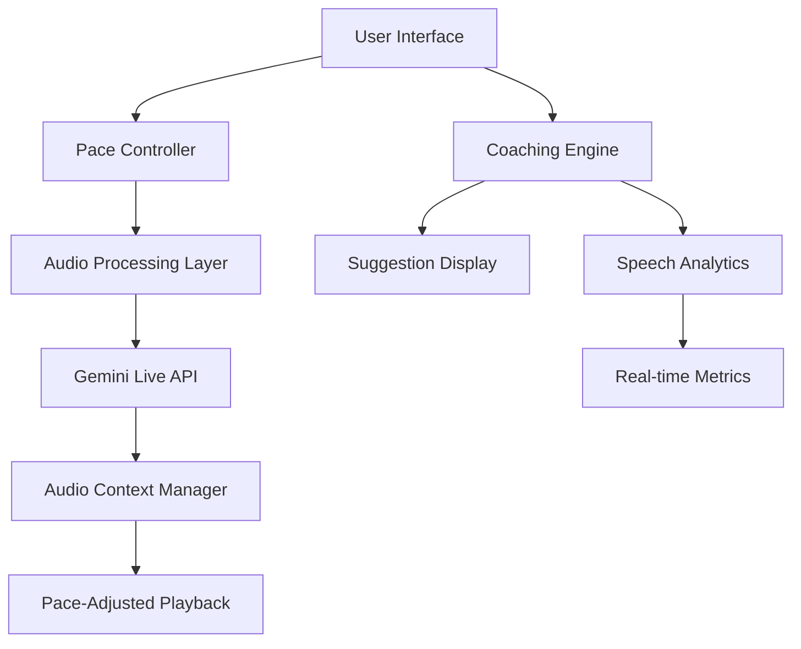

# Design Document: AI Pace Control and Real-Time Coaching

## Overview

This design implements two key enhancements to the VocalEdge AI Communication Coach:
1. **AI Speech Pace Control**: Allows users to adjust the speed of AI-generated speech (0.8x, 1.0x, 1.2x)
2. **Real-Time Coaching Suggestions**: Provides contextual feedback during active conversations

The solution integrates seamlessly with the existing Gemini Live API and Web Audio API infrastructure while maintaining the app's real-time performance characteristics.

## Architecture

### High-Level Architecture



### Component Integration

The new components integrate with existing systems:
- **CommunicationCoach**: Extended to support pace control and coaching callbacks
- **LiveMetrics**: Enhanced to trigger coaching suggestions
- **VoiceVisualizer**: Updated to display coaching overlays
- **Audio Pipeline**: Modified to apply pace adjustments

## Components and Interfaces

### 1. PaceController Component

**Purpose**: UI component for selecting AI speech pace

**Interface**:
```typescript
interface PaceControllerProps {
  currentPace: PaceSpeed;
  onPaceChange: (pace: PaceSpeed) => void;
  disabled?: boolean;
}

type PaceSpeed = 'slow' | 'normal' | 'fast';
```

**Implementation**:
- Three-button toggle interface (Slow/Normal/Fast)
- Visual feedback for current selection
- Persists selection to localStorage
- Integrates with existing UI design system

### 2. CoachingEngine Service

**Purpose**: Analyzes conversation patterns and generates real-time suggestions

**Interface**:
```typescript
interface CoachingEngine {
  analyzeSpeechPattern(metrics: RealtimeMetrics): CoachingSuggestion | null;
  setScenarioContext(scenario: ScenarioType): void;
  setSuggestionsEnabled(enabled: boolean): void;
}

interface CoachingSuggestion {
  id: string;
  type: 'energy' | 'pace' | 'pause' | 'clarity' | 'filler';
  message: string;
  detailedTip?: string;
  priority: 'low' | 'medium' | 'high';
}
```

**Core Logic**:
- Monitors real-time metrics (energy, pace, silence duration)
- Applies scenario-specific coaching rules
- Implements suggestion throttling (max 1 per 30 seconds)
- Queues multiple suggestions for sequential display

### 3. SuggestionDisplay Component

**Purpose**: Non-intrusive overlay for coaching suggestions

**Interface**:
```typescript
interface SuggestionDisplayProps {
  suggestion: CoachingSuggestion | null;
  onDismiss: () => void;
  onExpand: (suggestion: CoachingSuggestion) => void;
}
```

**Features**:
- Auto-dismiss after 4 seconds
- Tap to expand for detailed guidance
- Smooth animations (fade in/out)
- Positioned to avoid conversation flow disruption

### 4. Enhanced Audio Processing

**Purpose**: Apply pace adjustments to AI-generated speech

**Implementation**:
```typescript
interface AudioPaceProcessor {
  applyPaceAdjustment(audioBuffer: AudioBuffer, pace: number): AudioBuffer;
  createPacedSource(audioData: ArrayBuffer, pace: number): AudioBufferSourceNode;
}
```

**Technical Approach**:
- Uses Web Audio API's `playbackRate` property
- Maintains audio quality through proper resampling
- Preserves natural speech patterns and intonation

## Data Models

### Pace Settings Model

```typescript
interface PaceSettings {
  currentPace: PaceSpeed;
  paceMultiplier: number; // 0.8, 1.0, 1.2
  persistAcrossSessions: boolean;
}

const PACE_MULTIPLIERS = {
  slow: 0.8,
  normal: 1.0,
  fast: 1.2
} as const;
```

### Coaching Analytics Model

```typescript
interface CoachingAnalytics {
  sessionId: string;
  suggestionsShown: CoachingSuggestion[];
  suggestionsActedUpon: string[]; // suggestion IDs
  averageResponseTime: number;
  improvementMetrics: {
    energyTrend: number[];
    paceTrend: number[];
    pauseQuality: number[];
  };
}
```

### Real-time Metrics Extension

```typescript
interface EnhancedRealtimeMetrics extends RealtimeMetrics {
  silenceDuration: number;
  fillerWordCount: number;
  speechClarity: number;
  conversationFlow: 'smooth' | 'hesitant' | 'rushed';
}
```

## Correctness Properties

*A property is a characteristic or behavior that should hold true across all valid executions of a system-essentially, a formal statement about what the system should do. Properties serve as the bridge between human-readable specifications and machine-verifiable correctness guarantees.*

### Property-Based Testing Overview

The following properties ensure the AI pace control and real-time coaching features work correctly across all possible inputs and scenarios.

### Core Properties

**Property 1: Pace Application Consistency**
*For any* pace setting change, all subsequent AI audio responses should have their playback rate adjusted to match the selected pace multiplier
**Validates: Requirements 1.2, 1.5**

**Property 2: Pace Persistence**
*For any* pace setting selection, the setting should persist across session restarts and language changes
**Validates: Requirements 1.4, 4.1**

**Property 3: Suggestion Triggering**
*For any* speech pattern that meets trigger conditions (energy < 0.3, pace > 8 peaks/sec, pause > 3 sec), the appropriate coaching suggestion should be generated
**Validates: Requirements 2.1, 2.2, 2.3**

**Property 4: Suggestion Rate Limiting**
*For any* sequence of suggestion triggers, no more than one suggestion should be displayed per 30-second interval
**Validates: Requirements 2.5**

**Property 5: Suggestion Display Behavior**
*For any* coaching suggestion, it should display as an overlay that auto-dismisses after 4 seconds and can be expanded on tap
**Validates: Requirements 3.1, 3.3**

**Property 6: Suggestion Queuing**
*For any* set of simultaneous suggestion triggers, suggestions should be queued and displayed sequentially rather than overlapping
**Validates: Requirements 3.2**

**Property 7: Session Continuity**
*For any* pace change or suggestion display, the practice session should continue without interruption or audio lag
**Validates: Requirements 2.6, 5.4**

**Property 8: Performance Timing**
*For any* user interaction with pace controls, the system should respond within the specified time limits (100ms for UI, 200ms for pace application, 500ms for suggestion analysis)
**Validates: Requirements 5.1, 5.2, 5.5**

**Property 9: Language Compatibility**
*For any* supported language, pace controls should display appropriate labels and pace adjustments should work correctly including RTL languages
**Validates: Requirements 4.2, 4.3**

**Property 10: Data Collection Consistency**
*For any* coaching session, coaching analytics data should be collected regardless of whether suggestions are enabled or disabled
**Validates: Requirements 3.5**

## Error Handling

### Pace Control Error Scenarios

1. **Audio Context Failure**: If Web Audio API fails, gracefully degrade to normal pace with user notification
2. **Invalid Pace Values**: Validate pace multipliers and fallback to normal (1.0x) for invalid inputs
3. **Storage Persistence Failure**: Handle localStorage unavailability by using session-only pace settings

### Coaching Engine Error Scenarios

1. **Metrics Analysis Failure**: Continue session without suggestions if analysis fails, log error for debugging
2. **Suggestion Display Failure**: Ensure conversation continues even if suggestion UI fails to render
3. **Performance Degradation**: Implement circuit breaker to disable suggestions if analysis takes too long

### Recovery Strategies

- **Graceful Degradation**: Core conversation functionality continues even if pace/coaching features fail
- **User Notification**: Inform users of feature unavailability without disrupting session flow
- **Automatic Retry**: Retry failed operations with exponential backoff for transient failures

## Testing Strategy

### Dual Testing Approach

The implementation will use both unit tests and property-based tests to ensure comprehensive coverage:

**Unit Tests** focus on:
- Specific UI component behavior (pace controller display, suggestion overlay)
- Integration points between components
- Edge cases and error conditions
- Performance timing validation

**Property-Based Tests** focus on:
- Universal properties across all inputs (pace application, suggestion triggering)
- Comprehensive input coverage through randomization
- Cross-language compatibility testing
- Performance consistency across different scenarios

### Property Test Configuration

- **Minimum 100 iterations** per property test due to randomization
- **Test tags** reference design document properties: `Feature: ai-pace-and-coaching, Property {number}: {property_text}`
- **Scenario coverage** includes all persona types and language combinations
- **Performance benchmarks** validate timing requirements under various load conditions

### Integration Testing

- **End-to-end flows** test complete user journeys with pace changes and coaching
- **Cross-browser compatibility** ensures Web Audio API features work consistently
- **Mobile responsiveness** validates touch interactions and performance on mobile devices
- **Accessibility compliance** ensures pace controls and suggestions work with screen readers

## Implementation Notes

### Technical Considerations

1. **Web Audio API Compatibility**: Ensure playbackRate adjustments work across all supported browsers
2. **Memory Management**: Properly dispose of audio buffers and suggestion timers to prevent leaks
3. **Performance Monitoring**: Track suggestion analysis timing to ensure sub-500ms performance
4. **Accessibility**: Ensure pace controls and suggestions are accessible via keyboard and screen readers

### Integration Points

1. **CommunicationCoach Service**: Extend existing audio processing pipeline
2. **LiveMetrics Component**: Add coaching trigger logic to existing metrics collection
3. **Local Storage**: Use existing preference storage patterns for pace persistence
4. **Translation System**: Integrate pace control labels with existing TRANSLATIONS constant

### Future Extensibility

1. **Additional Pace Options**: Architecture supports easy addition of more pace levels
2. **Custom Coaching Rules**: Suggestion engine designed for easy rule customization
3. **Advanced Analytics**: Coaching data structure supports future ML-based insights
4. **Voice Training Integration**: Foundation for future pronunciation coaching features